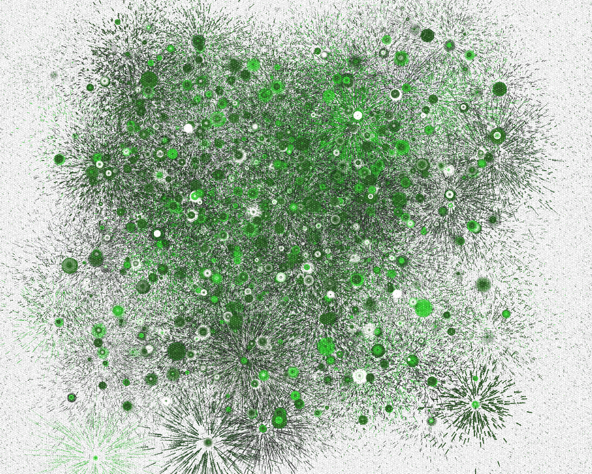
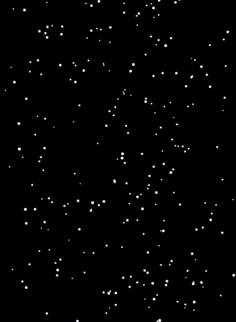

# yilu0178_9103_TUTJoel

# Quiz 8

## Imaging Technique Inspiration
[Generative Artwork:RE:BubbleChamber_4](https://p5js.org/examples//classes-and-objects-connected-particles/)

I have chosen this generative artwork as my visual inspiration. This piece uses randomly generated bubbles and lines that continuously evolve over time, eventually forming a complete artwork.I believe this artwork demonstrates how simple shapes can be randomly combined to create new artistic compositions. For our project requirements, we need to generate animations based on provided artworks. This particular piece's approach perfectly aligns with our goal - it can systematically reinterpret and regenerate the original artwork's basic geometric elements.
  
*The Artwork*

---

## Coding Technique Exploration  
[Reference coding](https://p5js.org/examples//classes-and-objects-connected-particles/)

For my project, I aim to digitally recreate this dotted artistic effect. This is the Connected Particles code in p5.js that I found. I believe this coding technique can serve as a reference to generate circular elements with random colors, thereby simulating the same effect with artworks.
  
*The particle system on P5js*

Through this technique, we can control the density of same-color circles being generated. This allows differently colored circles to continuously form and compose the image.

  
*The use of a particle system*